# ShowCraft — Portfolio Builder Platform

> **The all-in-one SaaS platform for developers and designers to create stunning portfolio websites — no code required.**

[](https://showcraft.netlify.app)
[](https://portfolio-production-2376.up.railway.app)
[](https://react.dev)
[](https://djangoproject.com)

---

## 🚀 Overview

ShowCraft is a **full-stack multi-user SaaS portfolio builder**. Users register an account, fill in their information through an admin dashboard, and instantly get a shareable portfolio link. Each portfolio is publicly accessible, fully responsive, and supports dark/light themes.

| Field | Details |
|-------|---------|
| **Project** | ShowCraft |
| **Type** | Multi-user SaaS Portfolio Builder |
| **Developer** | Ali Hassan |
| **Institution** | University of Education, Lahore — Dept. of Information Science (2024–2026) |
| **Live URL** | https://showcraft.netlify.app |


---

## 🛠 Tech Stack

### Frontend
| Technology | Purpose |
|------------|---------|
| React 18 + Vite | UI framework + build tool |
| React Router v6 | Client-side routing |
| Framer Motion | Animations and transitions |
| Axios + JWT Interceptors | HTTP requests with auto token refresh |
| Tailwind CSS | Utility-first styling |
| React Toastify | Notification system |
| Supabase JS | File / image / CV uploads |

### Backend
| Technology | Purpose |
|------------|---------|
| Django 5.2 | Web framework |
| Django REST Framework | REST API |
| SimpleJWT | JWT authentication |
| PostgreSQL (Railway) | Primary database |
| WhiteNoise | Static file serving |
| django-cors-headers | CORS management |
| Gmail SMTP | OTP and notification emails |

### Infrastructure
| Service | Purpose |
|---------|---------|
| Netlify | Frontend deployment with CI/CD |
| Railway | Backend + PostgreSQL hosting |
| Supabase Storage | Images and CV file storage |
| ipapi.co | IP geolocation for analytics |
| Web3Forms | Contact form email routing |

---

## ✨ Features

### 🔐 Authentication System
- JWT-based login and registration (access token 60 min, refresh token 7 days)
- Email OTP verification on registration (6-digit, 5-minute expiry)
- 3-step forgot password: Email → OTP → New Password
- Google OAuth login (implicit flow)
- GitHub OAuth login (authorization code flow)
- Auto-logout after 10 minutes of inactivity
- Password strength indicator and show/hide toggle
- Inline real-time field validation
- Resend OTP with 60-second countdown

### 🛠 Admin Dashboard
- **4-section portfolio builder:** Home Info, About Me, Projects, Footer
- **Home Info:** logo title, full name, skill title, experience, profile image, CV upload
- **About Me:** primary/secondary skill, projects count, education, skills list, about image
- **Projects:** name, skills, live URL, cover image — with delete, pagination, and detail page
- **Project Detail Page:** add and edit detailed information per project *(built independently)*
- **Footer:** display name, email, copyright, LinkedIn, GitHub, WhatsApp
- **Custom Slug URL:** set a custom portfolio URL e.g. `/portfolio/john-dev` *(built independently)*
- Generate and copy portfolio link with one click
- Preview portfolio in new tab from sidebar
- Delete account with confirmation modal
- Analytics dashboard — see below

### 📊 Portfolio Analytics
- Total visits, today, this month, last month (with trend vs yesterday)
- Last 7 days animated bar chart
- Device breakdown: Mobile / Tablet / Desktop with % bars
- Top 5 countries with % bars
- Browser breakdown: Chrome, Firefox, Safari, Edge, Opera
- Auto-tracks every portfolio visit (device, browser, country via ipapi.co)

### 🌐 Public Portfolio
- Sticky glassmorphism header with smooth scroll + mobile sidebar
- Hero section: circular avatar with ring animation, name, title, CTA buttons, scroll indicator
- About: two-column layout, info cards, skill chips parsed from DB
- Work: project card grid, hover zoom overlay, skill tags, pagination
- Contact form: **sends directly to portfolio owner's email** (fetched dynamically)
- Footer: CTA section, email button, social links
- Custom slug resolution: `/portfolio/slug` → resolves to real username for all API calls
- 404 Not Found page for invalid portfolio URLs

### 🏠 SaaS Landing Page
- Hero with animated gradient orbs and stats
- Features, How It Works, Pricing, Testimonials sections
- CTA banner and contact form (routes to owner email)
- Language switcher: English, Spanish, Urdu, Arabic
- Fully responsive across all screen sizes

---

## 📁 Folder Structure

```
frontend/src/
├── landing/                  # SaaS landing page
│   ├── LandingPage.jsx
│   ├── landing.css
│   ├── data.js
│   └── components/           # Nav, Hero, Features, HowItWorks, Pricing, Testimonials, CTABanner, Contact, Footer
├── admin/                    # Admin dashboard + auth pages
│   ├── admin.jsx             # Home Info page
│   ├── AdminAbout.jsx
│   ├── AdminProjects.jsx
│   ├── AdminFooter.jsx
│   ├── Analytics.jsx
│   ├── AdminSidebar.jsx
│   ├── Headertheme.jsx
│   ├── ConfirmModal.jsx
│   ├── LoginPage.jsx
│   ├── RegisterPage.jsx
│   ├── ForgotPasswordPage.jsx
│   ├── OAuthCallback.jsx
│   ├── forgot/               # Step1Email, Step2OTP, Step3NewPassword, SuccessScreen
│   ├── admin.css
│   ├── analytics.css
│   └── auth.css
├── components/               # Public portfolio components
│   ├── portfolio.css         # Shared design system
│   ├── header.jsx
│   ├── home.jsx
│   ├── about.jsx
│   ├── work.jsx
│   ├── form.jsx
│   └── footer.jsx
├── page/
│   ├── UserPortfolio.jsx     # Resolves slug → username → renders portfolio
│   ├── ThemeContext.jsx
│   ├── loading.jsx
│   └── errorPage.jsx
├── utils/
│   ├── axiosInstance.js      # JWT interceptors + auto-refresh
│   ├── validators.js         # Form validation functions
│   ├── notifications.js      # Toast notification helpers
│   └── oauth.js              # Google + GitHub OAuth initiators
├── AuthContext.jsx            # JWT auth context
├── main.jsx                   # Router with all routes
└── index.css                  # Global styles + theme variables

backend/portfolio/
├── models.py                  # HomeInfo, AboutInfo, ProjectsInfo, FooterInfo,
│                              #   OTPVerification, PortfolioVisit, PortfolioLink
├── views.py                   # All API views
├── serializer.py              # DRF serializers
├── urls.py                    # URL patterns
├── utils.py                   # OTP generator + email sender
└── settings.py                # Django config
```

---

## 📡 API Endpoints

### Authentication
| Method | Endpoint | Description |
|--------|----------|-------------|
| POST | `/api/register/` | JWT register → returns access + refresh tokens |
| POST | `/api/login/` | JWT login → returns access + refresh tokens |
| POST | `/api/token/refresh/` | Refresh expired access token |
| POST | `/api/send-otp/` | Send 6-digit OTP to email |
| POST | `/api/verify-otp/` | Verify OTP code |
| POST | `/api/auth/google/` | Google OAuth → returns JWT |
| POST | `/api/auth/github/` | GitHub OAuth → returns JWT |
| POST | `/api/forgot-password/send-otp/` | Send password reset OTP |
| POST | `/api/forgot-password/verify-otp/` | Verify reset OTP |
| POST | `/api/forgot-password/reset/` | Set new password |

### Portfolio Data
| Method | Endpoint | Description |
|--------|----------|-------------|
| GET | `/get-home-info/?username=` | Get home section data |
| POST | `/add-home-info/` | Create or update home section |
| GET | `/get-about-info/?username=` | Get about section data |
| POST | `/add-about-info/` | Create or update about section |
| GET | `/get-footer-info/?username=` | Get footer data |
| POST | `/add-footer-info/` | Create or update footer |
| GET | `/get-projects-info/?username=` | Get all projects |
| POST | `/add-projects-info/` | Add a new project |
| DELETE | `/projects-del/<id>/` | Delete a project |
| DELETE | `/account-del/<username>/` | Delete account and all data |

### Analytics & Slug
| Method | Endpoint | Description |
|--------|----------|-------------|
| POST | `/api/track-visit/` | Track portfolio visit |
| GET | `/api/analytics/<username>/` | Get full analytics summary |
| GET | `/api/resolve/<identifier>/` | Resolve username or slug → real username |
| GET/POST/DELETE | `/portfolio-link/` | Manage custom slug |
| GET | `/portfolio-link/check-slug/` | Check slug availability |

---

## 🗺 Frontend Routes

| Route | Page |
|-------|------|
| `/` | ShowCraft SaaS landing page |
| `/admin/login` | Login page with Google + GitHub OAuth |
| `/admin/register` | Register page with OTP verification |
| `/admin/forgot-password` | 3-step forgot password page |
| `/oauth/callback` | OAuth redirect handler |
| `/admin` | Dashboard — Home Info |
| `/adminAbout` | Dashboard — About Me |
| `/adminProjects` | Dashboard — Projects |
| `/adminFooter` | Dashboard — Footer |
| `/adminAnalytics` | Portfolio Analytics |
| `/portfolio/:username` | Public portfolio (username or custom slug) |

---

## 🔑 Environment Variables

### Frontend — `.env.development`
```env
VITE_API_URL=http://127.0.0.1:8000
VITE_GOOGLE_CLIENT_ID=your_google_client_id
VITE_GITHUB_CLIENT_ID=your_github_client_id
VITE_GITHUB_CLIENT_SECRET=your_github_client_secret
```

### Frontend — `.env.production`
```env
VITE_API_URL=https://portfolio-production-2376.up.railway.app
VITE_GOOGLE_CLIENT_ID=your_google_client_id
VITE_GITHUB_CLIENT_ID=your_github_client_id
VITE_GITHUB_CLIENT_SECRET=your_github_client_secret
```

### Backend — `settings.py` key variables
```python
SECRET_KEY = 'your_django_secret_key'
DEBUG = False                          # True for local
ALLOWED_HOSTS = ['*']

# Database — Railway PostgreSQL
DATABASES = {
    'default': {
        'ENGINE': 'django.db.backends.postgresql',
        'NAME': 'railway',
        'USER': 'postgres',
        'PASSWORD': 'your_password',
        'HOST': 'your_host.railway.app',
        'PORT': '12345',
    }
}

# Email — Gmail SMTP
EMAIL_HOST_USER = 'your@gmail.com'
EMAIL_HOST_PASSWORD = 'your_app_password'

# JWT
SIMPLE_JWT = {
    'ACCESS_TOKEN_LIFETIME': timedelta(minutes=60),
    'REFRESH_TOKEN_LIFETIME': timedelta(days=7),
    'ROTATE_REFRESH_TOKENS': True,
    'BLACKLIST_AFTER_ROTATION': True,
}
```

---

## 💻 Local Setup

### Backend
```bash
# 1. Clone and navigate
git clone <repo-url>
cd portfolio_drf

# 2. Create virtual environment
python -m venv venv
venv\Scripts\activate       # Windows
source venv/bin/activate    # Mac/Linux

# 3. Install dependencies
pip install -r requirements.txt

# 4. Run migrations
python manage.py makemigrations
python manage.py migrate

# 5. Start server
python manage.py runserver
# → http://127.0.0.1:8000
```

### Frontend
```bash
# 1. Navigate to frontend
cd frontend

# 2. Install dependencies
npm install

# 3. Start dev server
npm run dev
# → http://localhost:5173
```

> The `.env.development` file automatically points Vite to `http://127.0.0.1:8000` so no manual URL changes are needed between local and production.

---

## 🚀 Deployment

### Frontend → Netlify
1. Connect GitHub repo to Netlify
2. Build command: `npm run build`
3. Publish directory: `dist`
4. Add environment variables in Netlify dashboard
5. Add `_redirects` file in `public/`: `/* /index.html 200`

### Backend → Railway
1. Connect GitHub repo to Railway
2. Add a `Procfile` in project root:
   ```
   web: gunicorn portfolio_drf.wsgi --bind 0.0.0.0:$PORT
   ```
3. Add PostgreSQL plugin in Railway dashboard
4. Set environment variables in Railway
5. Deploy — Railway auto-deploys on every push

### File Storage → Supabase
1. Create Supabase project
2. Create storage bucket named `portfolio` — set to **public**
3. Update `supabaseClient.js` with your project URL and anon key

---

## 🧠 Key Design Decisions

| Decision | Reason |
|----------|--------|
| **JWT over Sessions** | Stateless tokens work across different domains (Netlify + Railway) without cookie issues |
| **Supabase for files** | Offloads binary storage from Django — Django only stores public URLs |
| **Username-based models** | All portfolio models use a `username` CharField instead of ForeignKey for simpler public lookups |
| **Slug resolution endpoint** | `/api/resolve/<identifier>/` handles both username and custom slug URLs transparently |
| **axiosInstance** | Centralized interceptors auto-refresh JWT tokens on 401 without user interruption |
| **Web3Forms** | No backend needed for contact form — `to_email` field dynamically routes to each portfolio owner |
| **Silent visit tracking** | Tracking errors never break the portfolio page — wrapped in try/catch with console.warn only |
| **Single portfolio.css** | One CSS file for all portfolio components with CSS variables for instant theme switching |
| **OTP security** | Backend never reveals if email exists (forgot password) — always returns same success message |

---

---
## 📸 Screenshots

### 🏠 SaaS Landing Page

#### SaaS Landing Page
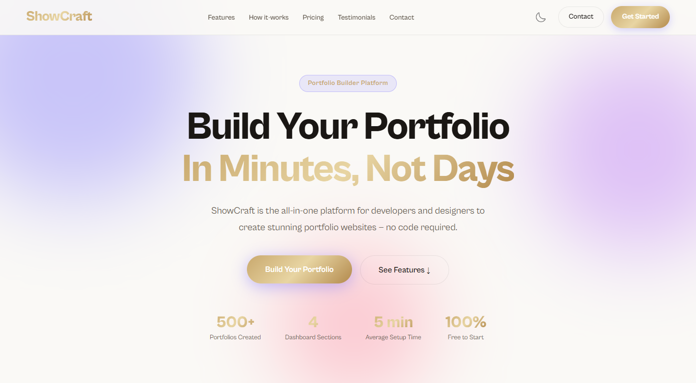
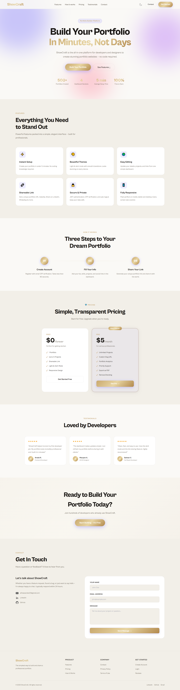
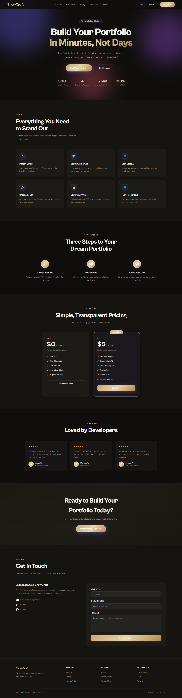

#### Login & OAuth
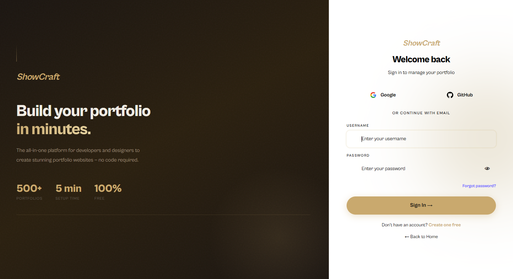

---

### 🛠 Admin Dashboard

#### Home Info Builder
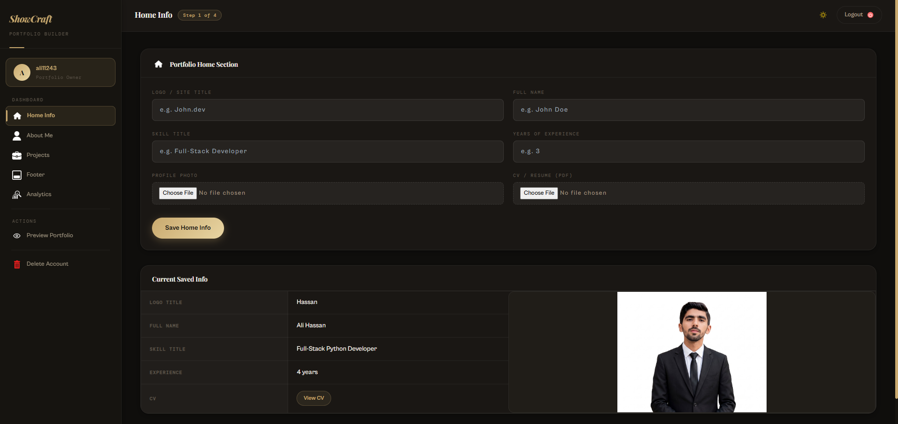
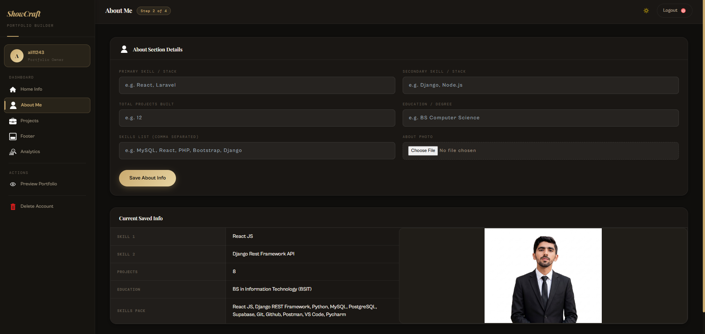
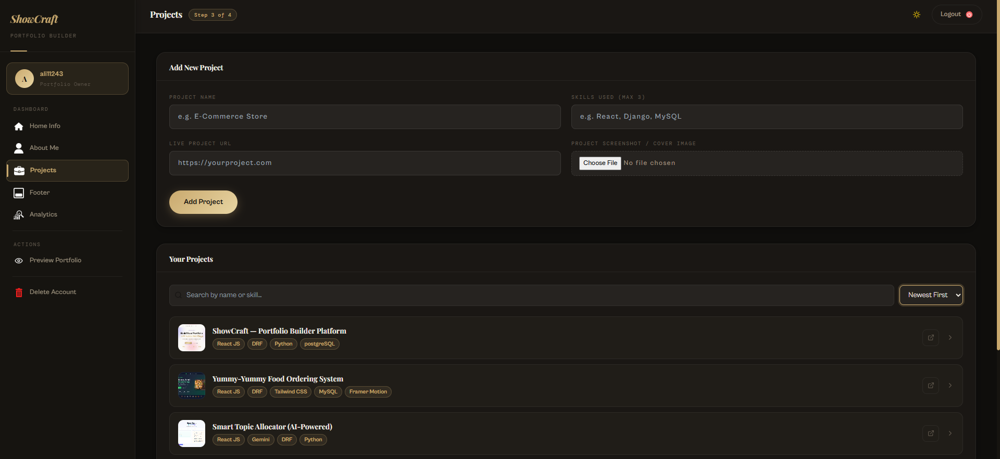
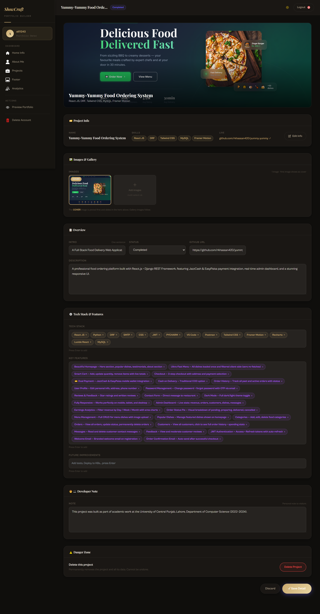
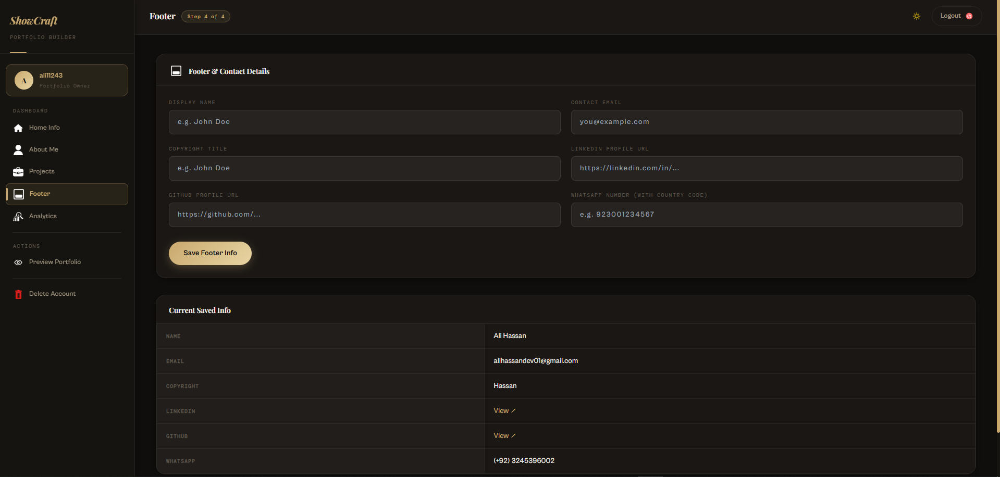
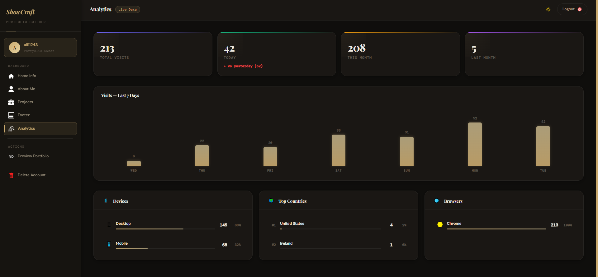
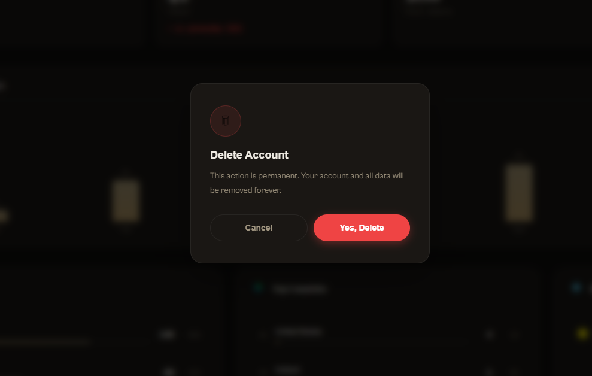
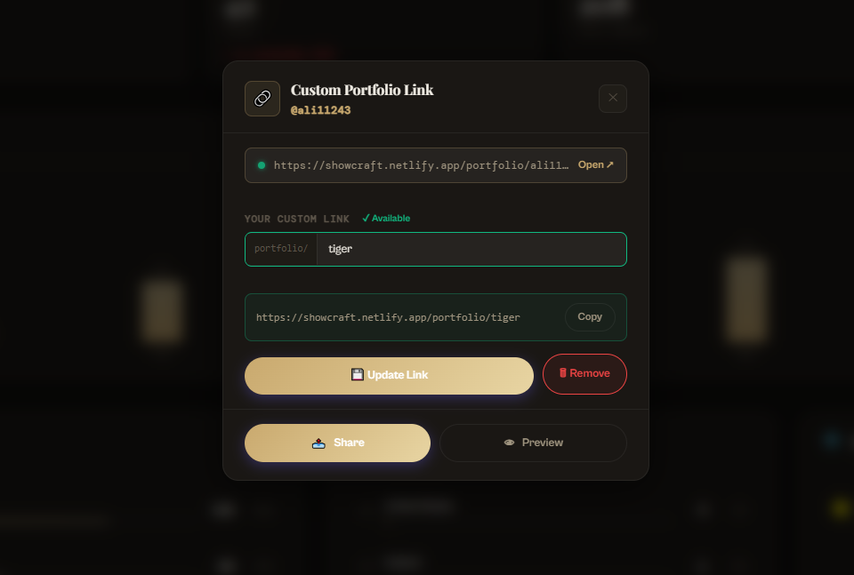

---

### 🌐 Public Portfolios

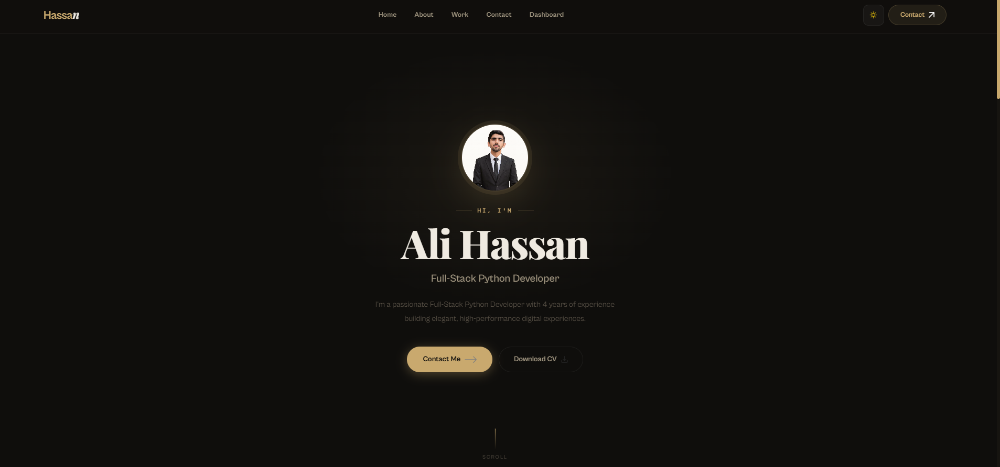
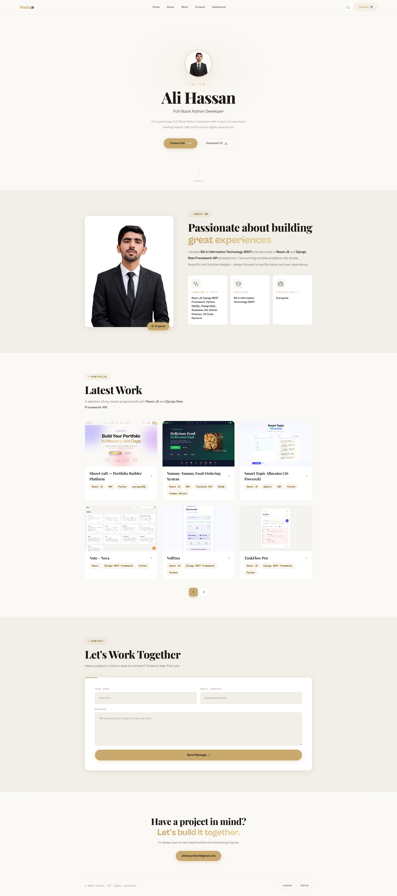
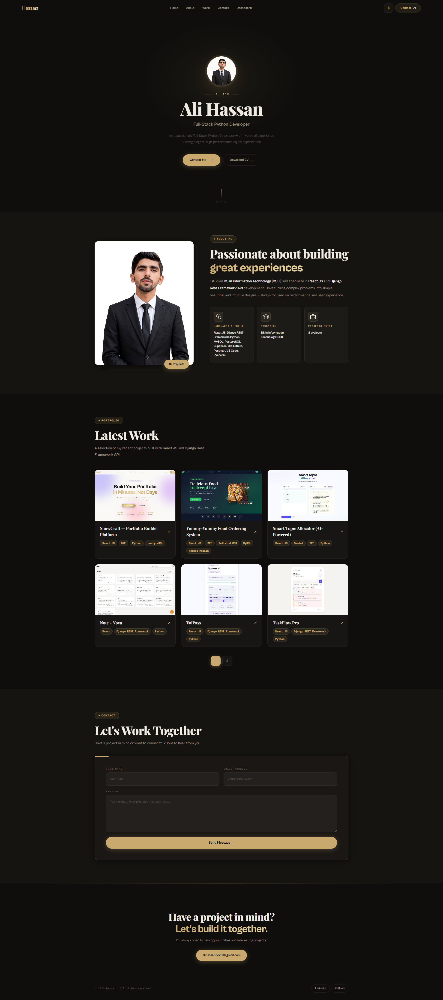
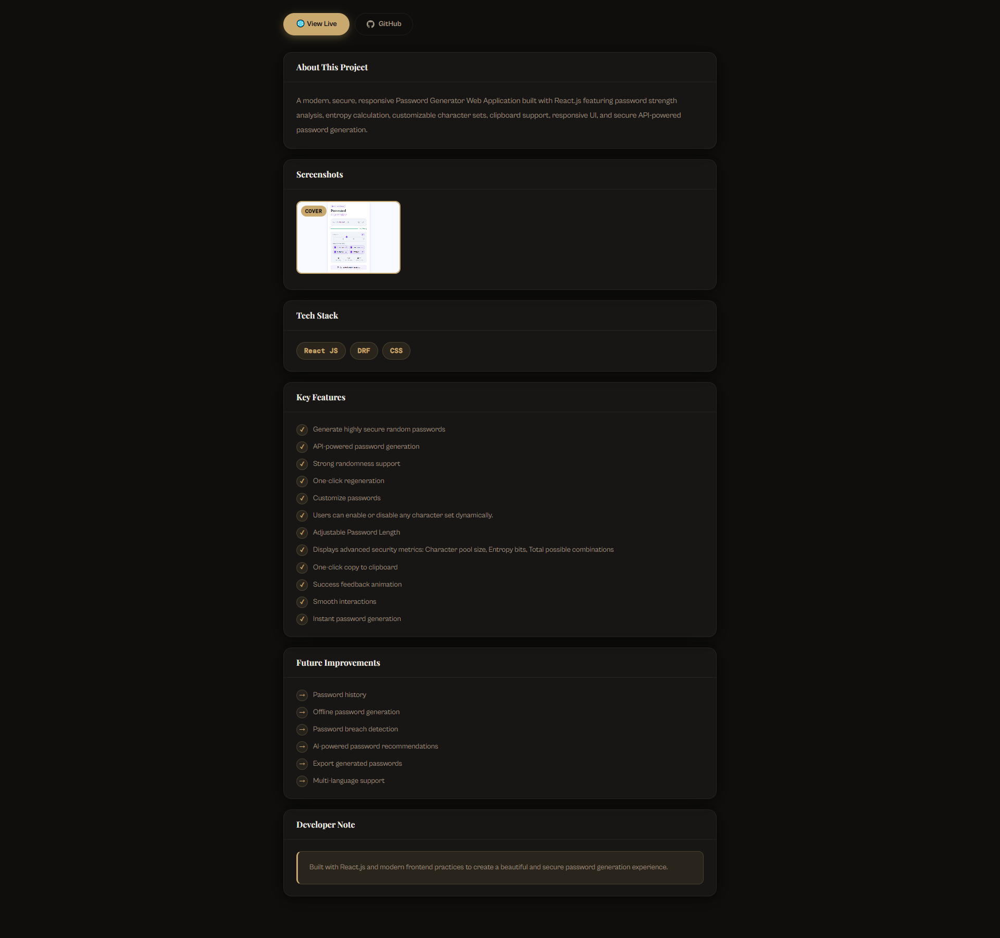

---

## 📄 License

This project was built as part of academic work at the **University of Education, Lahore**, Department of Information Science (2024–2026).

---

<div align="center">
  <strong>ShowCraft</strong> — Built with ❤️ by Ali Hassan
  <br/>
  University of Education, Lahore — 2025
</div>
